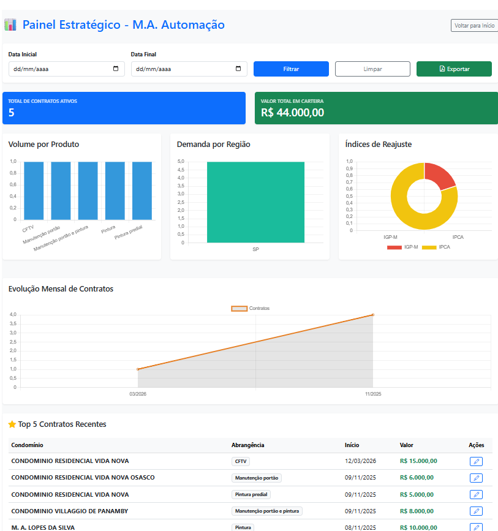

# Sistema de Gestão de Contratos - M.A. Automação

Desenvolvimento de um software com framework web que utiliza noções de banco de dados, praticando controle de versão e segurança da informação. Este projeto faz parte do portfólio acadêmico para a UNIVESP.

  

## 🚀 Funcionalidades
* **Dashboard de Gestão**: Visualização centralizada de contratos com busca por Razão Social, CNPJ ou CEP.
* **Interface Otimizada**: Tabela com rolagem vertical e botões de ação (PDF, Cláusulas, Editar, Excluir) integrados.
* **Geração de Documentos**: Exportação de contratos em PDF utilizando a biblioteca WeasyPrint.
* **Localização Brasileira**: Exibição de valores em Real (R$) e datas no formato DD/MM/AAAA.

## 🛠️ Tecnologias
* **Linguagem**: Python 3.x.
* **Framework Web**: Flask.
* **Banco de Dados**: SQLAlchemy (gerenciando SQLite/PostgreSQL).
* **Estilização**: HTML5 e CSS3 customizado para melhor usabilidade.

## 🛡️ Segurança e Manutenção (Destaque Acadêmico)
Este projeto mantém um alto padrão de manutenção preventiva:
* **Dependabot Ativo**: Monitoramento automático de vulnerabilidades em dependências de terceiros.
* **Resolução de Conflitos**: Recentemente, o projeto passou por uma refatoração para atualizar bibliotecas críticas como `urllib3 (2.6.3)`, `Flask (3.1.1)` e `WeasyPrint (68.0)`, garantindo a proteção contra falhas de segurança conhecidas.
* **Integração Contínua**: Uso de GitHub Actions para validação de código.

## ⚙️ Como Instalar
1. Clone o repositório.
2. Crie um ambiente virtual: `python -m venv venv`.
3. Ative o venv e instale as dependências: `pip install -r requirements.txt`.
4. Inicie o servidor: `flask run`.

---

## 🎯 Objetivo do Projeto
O **M.A. Automação** foi concebido para suprir a necessidade de organização e padronização na emissão de contratos condominiais. O foco principal foi a criação de uma ferramenta robusta que eliminasse erros manuais de preenchimento e garantisse que todos os documentos gerados seguissem as cláusulas jurídicas atualizadas, proporcionando agilidade e segurança jurídica para o síndico e para a administradora.

## 🏁 Conclusão
Através deste desenvolvimento, foi possível aplicar conceitos avançados de:
1. **Persistência de Dados**: Modelagem eficiente para garantir a integridade das informações dos contratos.
2. **Segurança de Software**: Manutenção proativa de dependências e resolução de vulnerabilidades críticas.
3. **Experiência do Usuário (UX)**: Design de interface focado em produtividade, com tabelas dinâmicas e acesso rápido a funções essenciais.

Este projeto representa um ciclo completo de desenvolvimento de software, desde a concepção da lógica de negócio até a implantação de práticas modernas de segurança e versionamento.